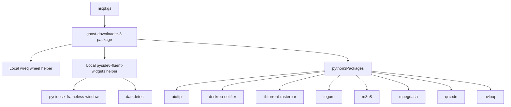

# Design Doc: Packaging Ghost-Downloader-3 for NixOS

This specification details the packaging of the `Ghost-Downloader-3` application for `nix-custompkgs`. It utilizes Nix packaging with inline dependencies for `wreq` and `pyside6-fluent-widgets` to prevent global python package pollution.

## 1. Objectives & Context

*   **Target Application**: `Ghost-Downloader-3` (v4.1.1), a PySide6-based GUI download manager with advanced multi-protocol support.
*   **Repository Location**: `/home/klein-moretti/nix-custompkgs`
*   **Target Package Directory**: `./pkgs/ghost-downloader-3/`
*   **Constraints**:
    *   Expose `ghost-downloader-3` as a top-level package.
    *   Do not pollute the top-level package namespace with internal python libraries (`wreq` and `pyside6-fluent-widgets`).
    *   Avoid complex local Rust compilation for `wreq` (which depends on BoringSSL/btls-sys) by resolving precompiled ABI3 wheels dynamically for Linux `x86_64` and `aarch64`.

---

## 2. Package Architecture & Specification

The package will be defined in `pkgs/ghost-downloader-3/default.nix`.



### A. Local Helper `wreq` (Python Package)
*   **Source**: PyPI ABI3 Wheel.
*   **Platform Support**:
    *   `x86_64-linux`: `wreq-0.12.0-cp311-abi3-manylinux_2_17_x86_64.manylinux2014_x86_64.whl`
        *   Hash: `sha256-rg5ObBvhcDFguIqZZwUurKSr2/4AFzGRL7Xe98vE5Ys=` (Nix Base32/SRI equivalent)
    *   `aarch64-linux`: `wreq-0.12.0-cp311-abi3-manylinux_2_34_aarch64.whl`
        *   Hash: `sha256-Nbx4mW8aRk5HTFsktHuw+WPsG+RJXg+jqXo6QIa4a2E=`
*   **Format**: `"wheel"`.
*   **Build/Runtime Dependencies**: `autoPatchelfHook`, `stdenv.cc.cc.lib`.

### B. Local Helper `pyside6-fluent-widgets` (Python Package)
*   **Source**: PyPI `pyside6_fluent_widgets-1.11.2.tar.gz`.
    *   Hash: `sha256-cf49ff76b9b2ad1dc24f071a1b2a3f5f0a67d7adf655915071ddfb7342caf175` (base32 or hex/SRI)
*   **Dependencies**: `pyside6`, `pysidesix-frameless-window`, `darkdetect`.

### C. Main Application `ghost-downloader-3`
*   **Builder**: `python3Packages.buildPythonApplication` with `format = "other"`.
*   **Source**: GitHub `XiaoYouChR/Ghost-Downloader-3` tag `v4.1.1` (Hash: `sha256-rg5ObBvhcDFguIqZZwUurKSr2/4AFzGRL7Xe98vE5Ys=`).
*   **Phases**:
    1.  **installPhase**:
        *   Create `$out/libexec/ghost-downloader-3/`.
        *   Copy the entire application codebase into the libexec directory.
        *   Create wrapper launcher script at `$out/bin/ghost-downloader-3` pointing to `python $out/libexec/ghost-downloader-3/Ghost-Downloader-3.py`.
        *   Install high-resolution logo from the codebase (e.g., `app/assets/image/logo.png`) into `$out/share/icons/hicolor/512x512/apps/ghost-downloader-3.png`.
        *   Generate a `.desktop` entry in `$out/share/applications/ghost-downloader-3.desktop` mapping executable and icon.
    2.  PostFixup:
        *   Run `wrapQtApp` via `qt6.wrapQtAppsHook` on the launcher binary or script to set dynamic library paths and Qt platform environments.

---

## 3. Verification Plan

1.  **Format Verification**: Run `nixfmt` on the package definition to ensure it meets repository standards.
2.  **Dry Run Evaluation**: Evaluate the package without building:
    ```bash
    nix-instantiate --eval -A ghost-downloader-3
    ```
3.  **Build Verification**: Build the package locally using `nix-build`:
    ```bash
    nix-build -A ghost-downloader-3
    ```
4.  **Runtime Validation**: Run the executable from the nix store to confirm that imports (`wreq`, `qfluentwidgets`, `libtorrent`, `pyside6`) work correctly, the window launches, and no Python import exceptions occur.
